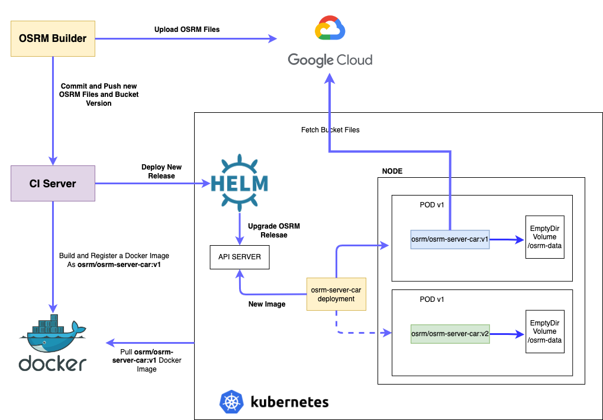

# OSRM Kubernetes

OSRM Kubernetes is a Helm Chart to Deploy OSRM Server using car profile as default. The Dockerfile specification in this project uses the [OSRM Fetcher](https://github.com/mig-elgt/osrm-fetcher) image. Before to run OSRM Server, fetcher binary will be exec to fetch the OSRM Files from Google Storage. OSRM Server needs these files in order to run the server. Take a look the [OSRM Project](https://github.com/Project-OSRM/osrm-backend/wiki) doc.



### Requirements

* Create a Secret Object in kubernetes with a Google Service Account file to read Bucket Objects.
* Replace your [OSRM Fetcher](https://github.com/mig-elgt/osrm-fetcher) Docker image in the Dockerfile Fetcher Stage

```
FROM gcr.io/mig-elgt/osrm-fetcher:v4 as fetcher

FROM osrm/osrm-backend:v5.22.0
RUN apt-get update && apt-get install -y ca-certificates
RUN update-ca-certificates
COPY --from=fetcher /usr/local/bin/app /usr/local/bin/fetcher
RUN chmod +x /usr/local/bin/fetcher

EXPOSE 5000
```

## Launch New OSRM Server Release

Everytime you want to do a new release add the new osrm builder version created by [OSRM Builder](https://github.com/mig-elgt/osrm-builder) in your Helm Chart Values

```
osrm:
  builder:
    version: osrm-server-car-v1599933468
```

## Notes

* Change Gitlab CI pipeline (.gitlab-ci) with your CI Server configuratino. This project comes from GitLab repository.
